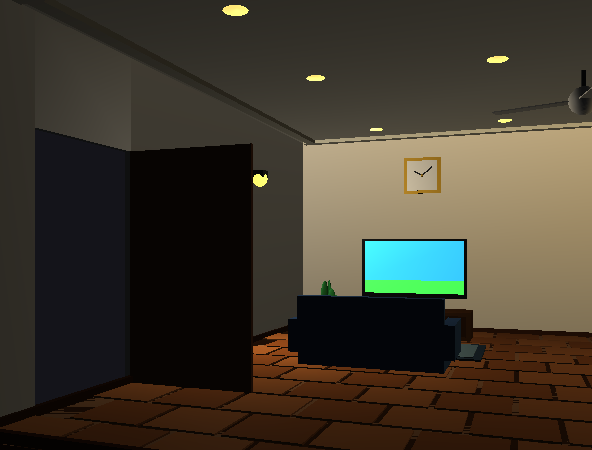
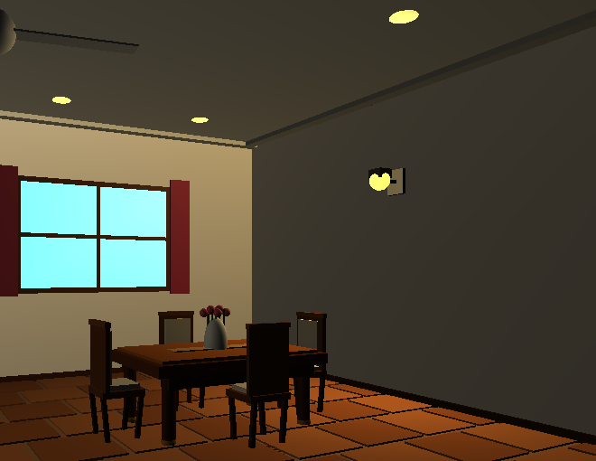

# 3D Interactive Living & Dining Room Scene (OpenGL / FreeGLUT)

An interactive, real-time 3D indoor architectural visualization developed in C++ using OpenGL, GLU, and FreeGLUT. The project simulates a furnished living and dining space complete with custom materials, lighting attenuation, and dynamic user controls.

---

## 📸 Screenshots

| Living Area & TV Console | Dining Area & Architecture |
| :---: | :---: |
|  |  |

---

## ✨ Features

- **Realistic Lighting & Materials:** Blinn-Phong material properties with localized point lights, specular highlights, and constant/linear attenuation.
- **Interactive Props & State Toggles:**
  - Dynamic interior lighting (Living room sconce & Dining area sconce).
  - Television power state (display toggle between glowing broadcast image and powered-off screen).
  - Smooth animated ceiling fan.
  - Interactive inward-opening wooden door.
- **Free-Look FPS Camera:** First-person view navigation with planar movement and mouse-drag pitch/yaw control.
- **Detailed 3D Modeling:** Custom-built parquet floor tiling, recessed ceiling fixtures, multi-piece dining chairs, runner table, curtains, and cushions using geometric primitives.

---

## 🎮 Controls

### Navigation
- `W` / `S` : Move camera Forward / Backward
- `A` / `D` : Strafe camera Left / Right
- `Up` / `Down` Arrow : Adjust camera height (Elevation)
- `Left` / `Right` Arrow : Turn camera angle (Yaw)
- `Mouse Left-Click + Drag` : Look around (FPS Camera)
- `Mouse Scroll Up / Down` : Quick Zoom / Step

### Interactions
- `1` : Toggle Living Room Light (Light 0)
- `2` : Toggle Dining Room Light (Light 1)
- `T` : Turn Television Screen ON / OFF
- `F` : Start / Stop Ceiling Fan
- `O` : Open / Close Front Door
- `ESC` : Exit Application

---

## 🛠️ Build & Run Instructions

### Prerequisites
Make sure you have a C++ compiler (`g++`) and OpenGL/GLUT development libraries installed.

#### On Ubuntu / Debian:
```bash
sudo apt update
sudo apt install build-essential freeglut3-dev libglu1-mesa-dev
